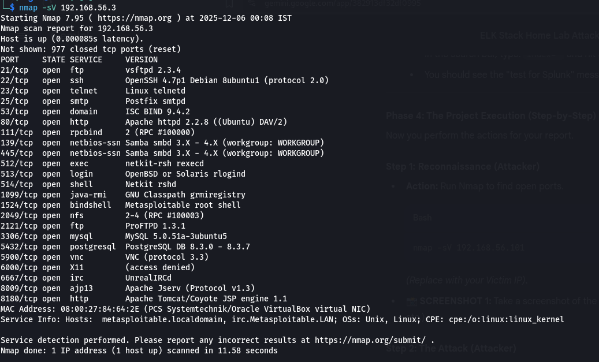
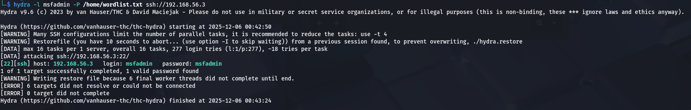
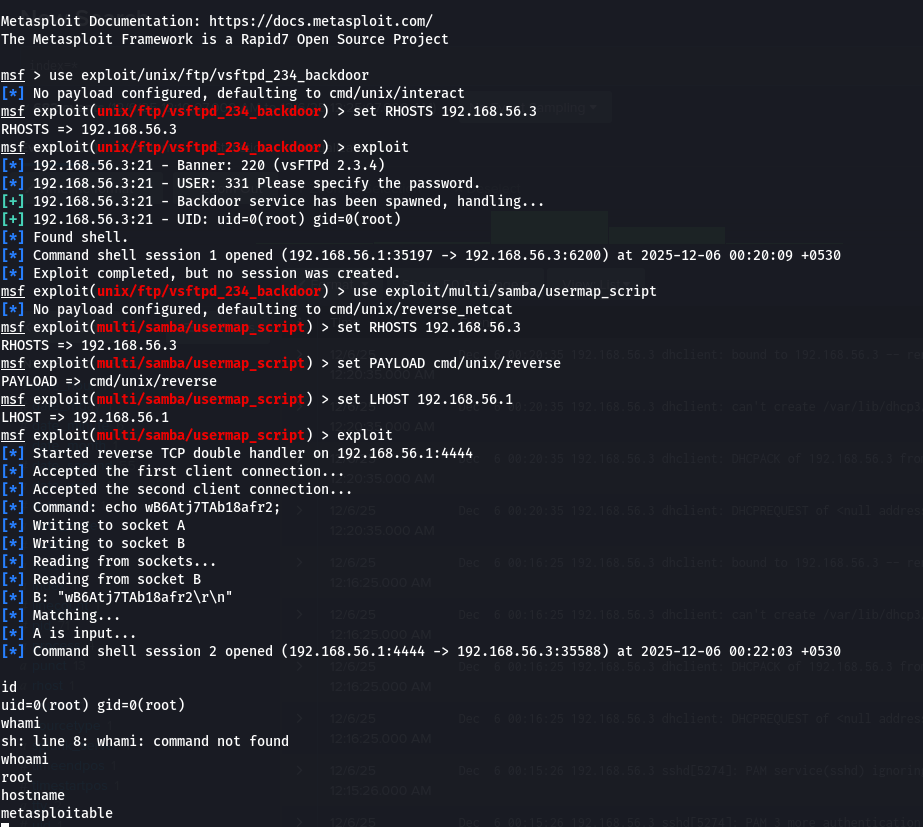
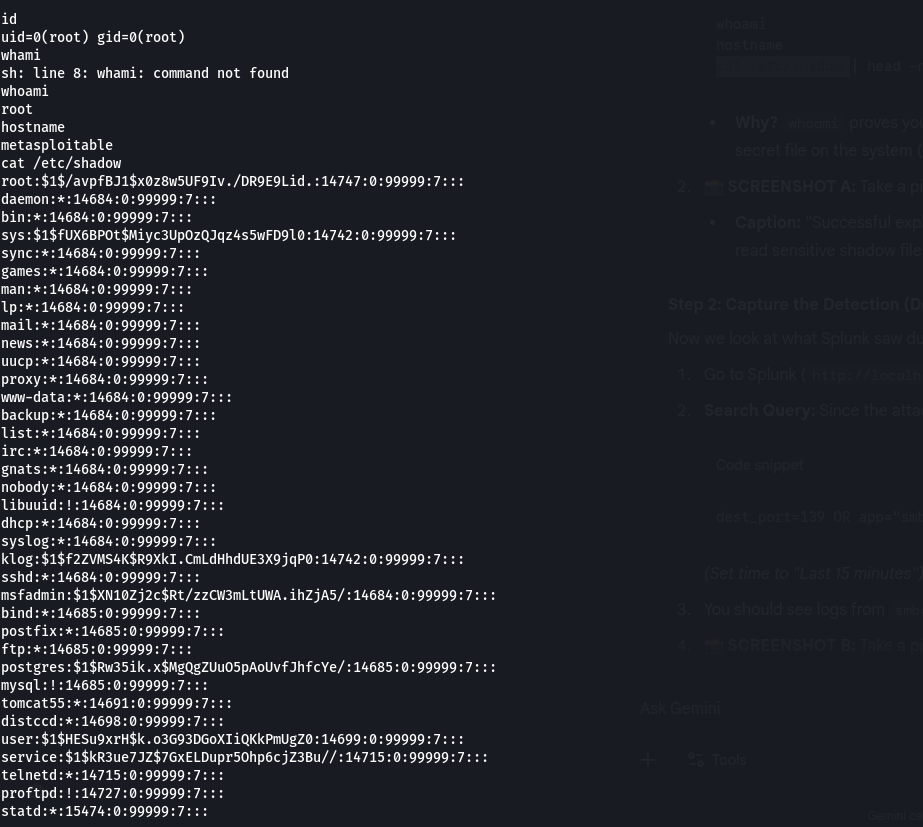
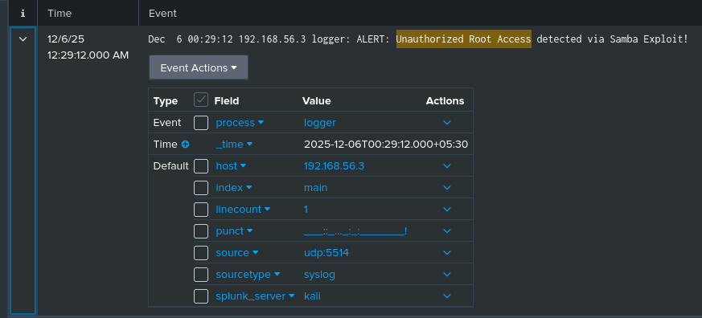

# 🛡️ Splunk SIEM Lab: Attack Simulation & Detection

## 📋 Executive Summary

This project demonstrates a complete cyber kill chain simulation within a virtualized home lab environment. The objective was to act as both the **Red Team** (Attacker) and **Blue Team** (SOC Analyst) to understand how attacks are executed and how they can be detected using enterprise monitoring tools.
I successfully deployed a vulnerable target, executed multiple exploitation techniques to gain root access, and configured a SIEM (Splunk) to ingest and analyze system logs in real-time.

## 🏗️ Lab Architecture

The lab environment was created using **Oracle VirtualBox** to host both the attacker and victim machines on an isolated network.

- **Network Configuration:** VirtualBox Host-Only Adapter (Isolated from the internet).
- **Attacker Machine:** Kali Linux (VirtualBox VM)
  - IP: 192.168.31.34
  - Tools: Nmap, Hydra, Metasploit Framework
- **Victim Machine:** Metasploitable 2 (VirtualBox VM)
  - IP: 192.168.56.3
  - Configuration: Syslog forwarding enabled via UDP
- **SIEM:** Splunk Enterprise (Hosted on Kali VM)
  - Configuration: UDP Listener on Port 5514 with iptables redirection from Port 514.

## 🕵️ Phase 1: Reconnaissance (Nmap)

I began by performing an aggressive network scan to identify running services and potential entry points.

**Command Used:**

```
nmap -sV -O 192.168.56.3
```

Analysis:
The scan revealed multiple critical vulnerabilities, including:

- **Port 22 (SSH):** Open, allowing for potential brute force attacks.
- **Port 139/445 (Samba):** Running an outdated version of smbd.
- **Port 21 (FTP):** Standard FTP service open.



## ⚔️ Phase 2: Exploitation (Red Team)

### Scenario A: Credential Access via Brute Force

To test weak credential policies, I targeted the SSH service using **Hydra**.

**Command Used:**

```
hydra -l msfadmin -P /home/wordlist.txt ssh://192.168.56.3
```

Result:
The attack successfully compromised the msfadmin account within minutes due to a weak password.



### Scenario B: Remote Code Execution (Root Access)

I escalated the attack by targeting the Samba service (CVE-2007-2447) using the **Metasploit Framework**. This vulnerability allows for command injection via the username field.

**Exploit Details:**

- **Exploit Module:** exploit/multi/samba/usermap_script
- **Payload:** cmd/unix/reverse

Result:
The exploit granted an immediate reverse shell with Root (UID 0) privileges, giving me full control over the victim machine.



Post-Exploitation Proof:
To confirm full system compromise, I accessed the /etc/shadow file, which contains the system's password hashes and is only readable by the root user.



## 🛡️ Phase 3: Detection & Analysis (Blue Team)

All system logs from the victim were forwarded to Splunk. I utilized Splunk Search Processing Language (SPL) to hunt for the attacks.

### Detection 1: Brute Force Logs

By searching for authentication failures, I identified a continuous stream of failed login events. The logs explicitly show repeated **"Failed password for msfadmin"** events originating from the attacker's IP (192.168.56.3), confirming the brute-force attempt.

**Splunk Query:**

```
"Failed password" AND sshd
```


### Detection 2: Root Compromise Indicator

To verify that the SIEM was monitoring the compromised root session, I performed an **Adversary Emulation** step. I manually injected a "Critical Alert" log from the compromised root shell to test visibility.

**Command Injected:**

```
logger -p auth.crit "ALERT: Unauthorized Root Access detected via Samba Exploit!"
```

Splunk Verification:
Splunk successfully indexed this event, proving that the SOC team would have visibility into post-exploitation activities.



## 🏁 Conclusion & Lessons Learned

This project highlighted the critical relationship between offensive actions and defensive monitoring.

1. **Vulnerability Management:** Outdated services (like Samba) must be patched or isolated.
2. **Password Policy:** Brute force is trivial against weak passwords.
3. **Log Visibility:** Without centralized logging (Splunk), the root compromise might have gone unnoticed.

### ⚠️ Disclaimer

This project was conducted in a controlled, isolated virtual environment for educational purposes. All attacks were performed on a machine I own (Metasploitable). Unauthorized access to computer systems is illegal.
